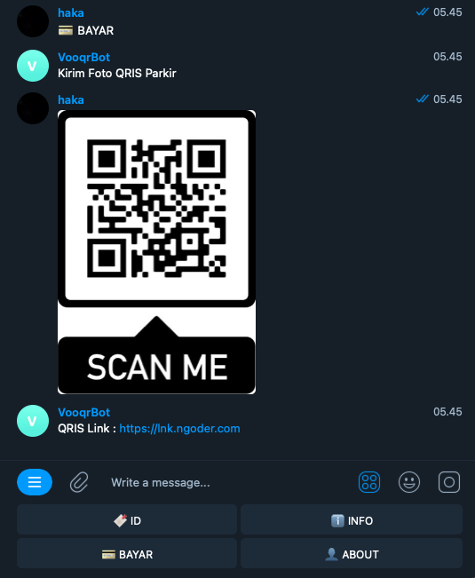

# telegram-bot-qr-scanner
Simple QRCode Scanner Telegram bot

## install
```sh
$ git clone https://github.com/mr687/telegram-bot-qr-scanner.git
$ cd telegram-bot-qr-scanner
$ npm install
$ cp .env.example .env
$ npm run start

# PUT your telegram token in .env file
```

## screenshost
